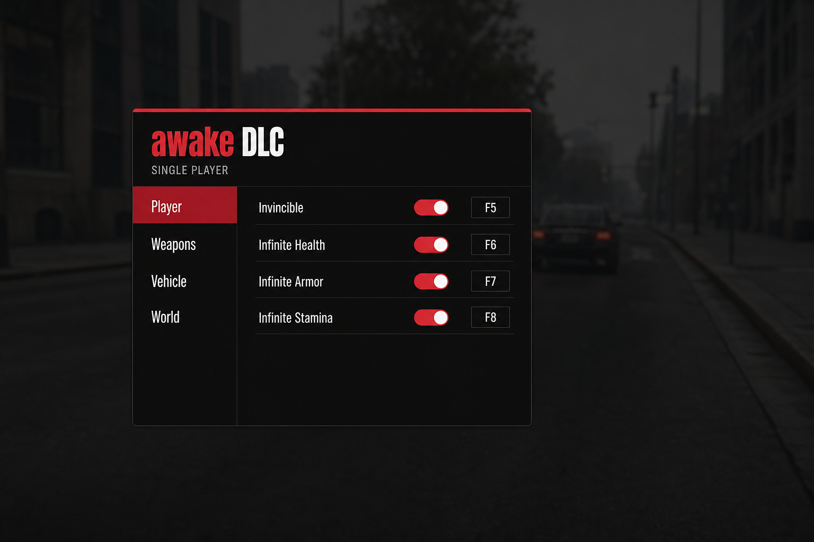

# awake DLC — меню для GTA IV

Компактный красно-чёрный оверлей поверх игры.  
**Только одиночная игра.** Insert — открыть / закрыть.



---

## Что умеет (v0.1)

| Вкладка | Функции |
|--|--|
| **Player** | God Mode, Never Wanted, Heal, Clear Wanted, +деньги |
| **Weapons** | Выдать / снять оружие |
| **Vehicle** | Починить / перевернуть машину |
| **World** | Время 12:00 / 00:00, очистить зону |

Позже дорисуем дизайн и накидаем ещё функций.

---

## Требования

1. **GTA IV** версии **1.0.7.0** или **1.0.8.0**  
   (Steam Complete Edition → нужен **downgrade**, иначе IV-SDK .NET не встанет)
2. **[IV-SDK .NET](https://github.com/ClonkAndre/IV-SDK-DotNet/releases)** установлен в папку игры
3. Visual Studio 2022 (сборка скрипта) **или** готовый `AwakeDLC.ivsdk.dll` из Releases

---

## Установка (кратко)

1. Поставь IV-SDK .NET по [Installation Guide](https://github.com/ClonkAndre/IV-SDK-DotNet/blob/main/Documentation/Installation.md)
2. Собери проект `AwakeDLC/AwakeDLC.csproj` (Release)
3. Скопируй `AwakeDLC.ivsdk.dll` в  
   `GTAIV\IVSDKDotNet\scripts\`
4. Запусти игру → **Insert** → меню **awake DLC**

### Сборка

```bat
cd awake-dlc\AwakeDLC
dotnet restore
dotnet build -c Release
```

Или открой `.csproj` в Visual Studio → Build.

---

## Управление

| Клавиша | Действие |
|--|--|
| **Insert** | Открыть / закрыть меню |
| Мышь | Клики по пунктам |

---

## Важно

- Не для мультиплеера / онлайн-сессий  
- После обновления игры проверь версию (снова 1.0.7.0 / 1.0.8.0)  
- Дизайн можно будет подкрутить отдельно от логики
